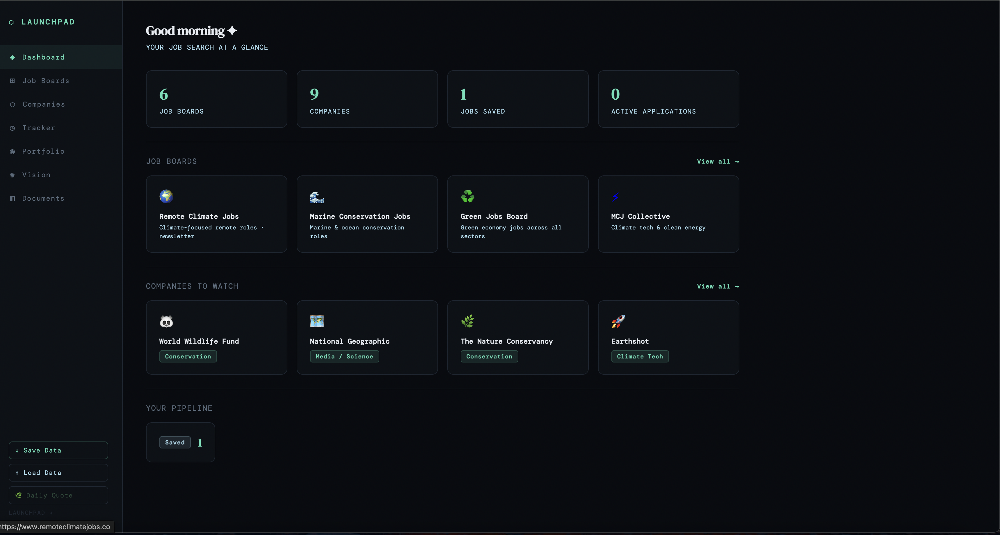
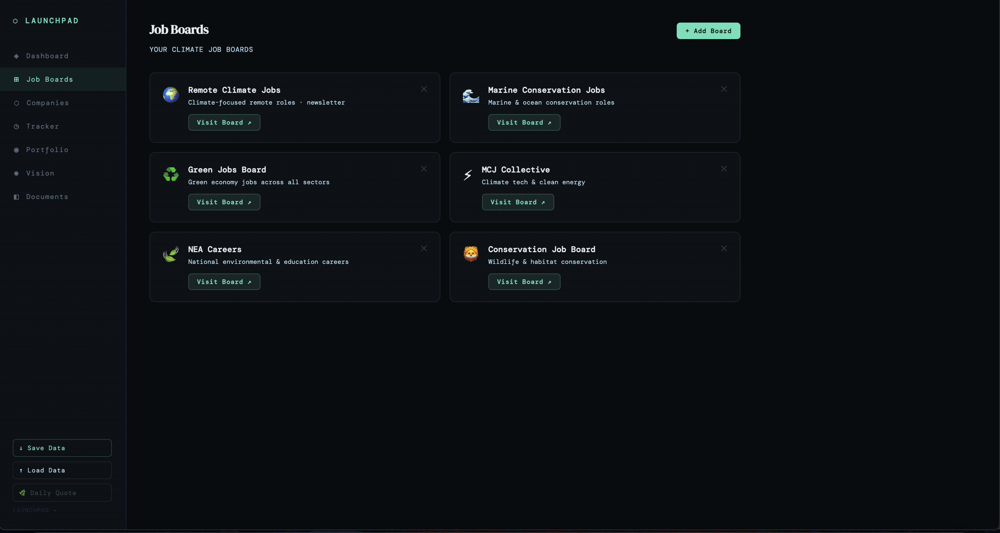
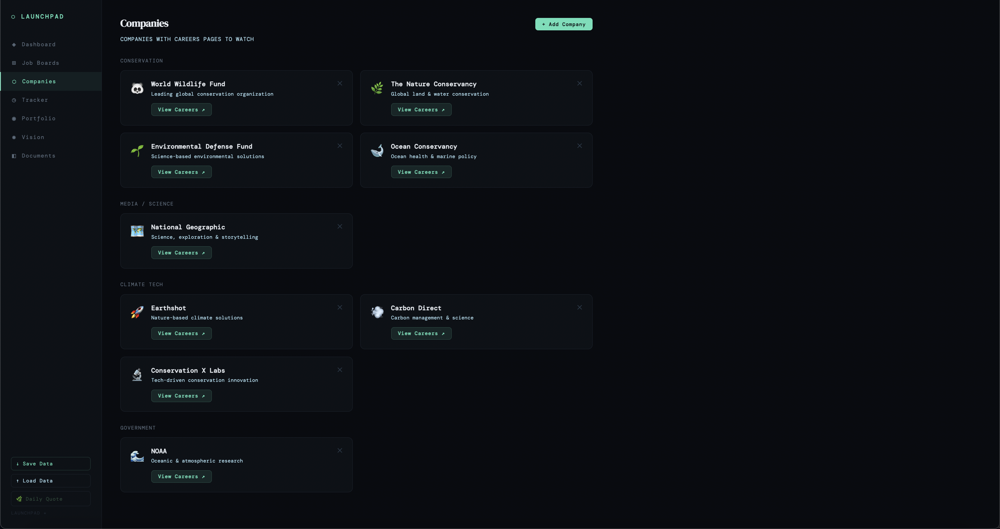
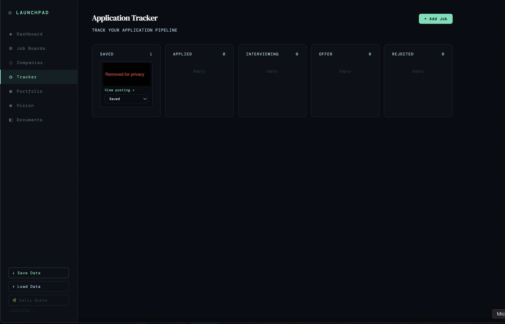
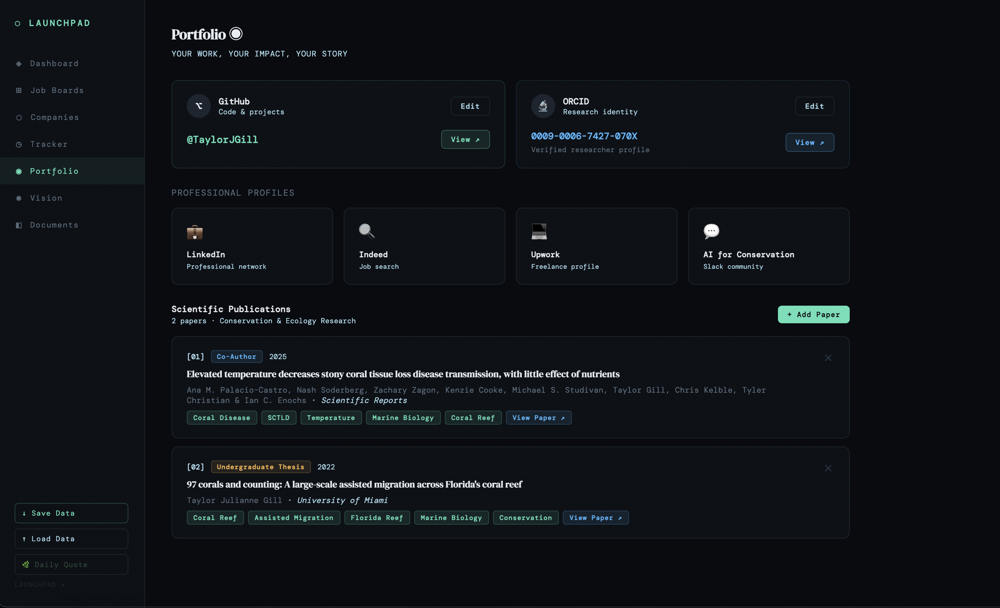

# 🌊 Launchpad — Personal Job Search Dashboard

A full-stack personal job search management platform built for 
managing a climate and conservation-focused job search in one place.

I wanted a more efficient way to track job boards, companies, 
applications, publications, and contacts — so I built it myself.

---

## Features

- **Dashboard** — Job search overview at a glance: boards, 
companies, saved jobs, and active applications
- **Job Boards** — Curated climate & conservation job boards 
with direct links, add your own
- **Companies** — Track companies to watch, organized by sector 
(Conservation, Climate Tech, Media/Science, Government)
- **Application Tracker** — Kanban-style pipeline to track 
applications from Saved → Applied → Interviewing → Offer → Rejected
- **Portfolio** — Centralized hub for GitHub, ORCID, publications, 
and professional profiles
- **Documents** — Resume versions, cover letter templates, 
and network contacts in one place
- **Vision** — A personal space to develop project ideas and 
builds geared toward my interests in conservation and technology. 
Safe place to save ideas and work on them over time
- **Data Persistence** — Save and load data locally so 
nothing gets lost between sessions

---

## Screenshots

### Dashboard

### Job Boards

### Companies

### Application Tracker

### Portfolio

---

## Tech Stack

- React (Hooks — useState, useEffect, useRef, useCallback)
- JavaScript / JSX
- LocalStorage for data persistence
- Hosted on StackBlitz

---

## Notes

Built as a personal tool for my own job search — 
source code is private.
